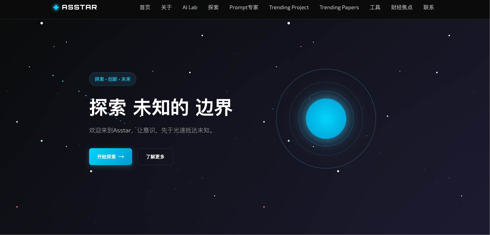

# Asstar - 探索未知的边界

  
  

    Asstar是一个为创作者、开发者与创新者打造的智能平台。我们聚合并解析全球前沿动态，将海量信息转化为您的清晰行动指南，助您高效探索、激发灵感并保持技术领先。
  

---

## 🌟 关于 Asstar

Asstar 是一个以探索为核心的网站，通过前沿技术、沉浸式体验和多样化内容，带你发现科学、艺术、技术等领域的无限魅力。我们希望每位用户都能在这里找到灵感，点燃好奇心，开启属于自己的探索之旅。

- **核心理念**: 探索、发现、创造
- **目标用户**: 好奇心驱动的探险家、创作者和终身学习者
- **愿景**: 打破常规，连接未知，激发无限可能

---

## 🚀 核心功能

- **探索模块**: 浏览涵盖科学、艺术、技术等多领域的精选内容，激发你的灵感。
- **Trending Project**: 实时展示GitHub、Huggingface社区最热门的开源项目，支持每日、每周、每月趋势查看。✨
- **Trending Papers**: 实时展示AI社区最热门的论文，支持Trending、Most Likes、Most Downloads分类 ✨
- **沉浸式体验**: 动态的界面设计和流畅的交互，带来无缝的浏览体验。
- **AI对话**: 基于通义千问的智能聊天助手，提供问题解答和创作建议。
- **探索**: 连接全球的探索者，分享发现、交流创意。
- **响应式设计**: 完美适配桌面和移动设备，随时随地探索。
- **工具盒子**: 基于自研和精选工具，来进一步工作提效。💕

## 📸 网站预览

 <!-- 替换为你的网站截图链接 -->

> **立即体验**: 访问 [Asstar 官网](https://asstar-x.github.io/) 开启你的探索之旅！ <!-- 替换为你的网站链接 -->

---

## 📖 如何开始

**访问网站**: 打开 [Asstar 官网](https://asstar-x.github.io/) 开始探索。

### 🤖 Prompt高级提示词优化功能

- **获取API密钥**: 访问[阿里云通义千问控制台](https://dashscope.console.aliyun.com/)获取API密钥（默认可以使用我们提供的密钥）
- **配置密钥**: 在提示词页面设置你的API密钥
- **开始对话**: 与AI助手进行实时对话，获得问题解答和创作建议

### 📊 Trending Project功能✨
- **实时数据**: 每天自动获取最新Github、Huggingface趋势数据
- **时间筛选**: 支持查看每日、每周、每月的热门项目
- **项目详情**: 显示项目描述、编程语言、星标数、Fork数等详细信息

### 🤖 Trending Papers功能 ✨
- **实时数据**: 每天自动获取最新论文趋势数据
- **分类筛选**: 支持每天、每周、每月、总收藏数四种分类
- **项目详情**: 显示模型描述、任务类型、参数数量、点赞数、下载数、标签等详细信息

##  🌍 兴趣太空
- **多元探索**：涵盖科技、设计、艺术、AI、开源文化、独立开发等前沿领域
- **精选推荐**：每周更新值得关注的项目、工具、博客与创作者
- **灵感碰撞**：记录有趣的想法实验学习路径分享

##  🌍 工具
- **自主研发**：我们亲自打造了多款独特工具，精准解决特定场景下的效率痛点，提供丝滑无缝的使用体验。
- **精选推荐**：甄别和测试了海量工具，只将那些真正高效、稳定、用户口碑极佳的优秀产品纳入推荐。
- **聚焦效率**：无论是代码开发、团队协作、设计创作还是知识管理，这里的每一款工具都旨在优化您的工作流程，助您事半功倍。

## 🤝 加入我们

我们欢迎每一位热爱探索的用户！通过以下方式与我们互动：

- **官网**: [Asstar](https://asstar-x.github.io/)
- **邮箱**: asstarx7@gmail.com
- **社区**: WX：AiSpinLab
- **反馈**: 在 GitHub Issues 中提交建议或想法

---

## 📄 许可证

本项目采用 [MIT 许可证](LICENSE) - 详情请见 LICENSE 文件。

---

**Asstar - 探索未知的边界**  
与我们一起，踏上发现之旅，探索无限可能！
